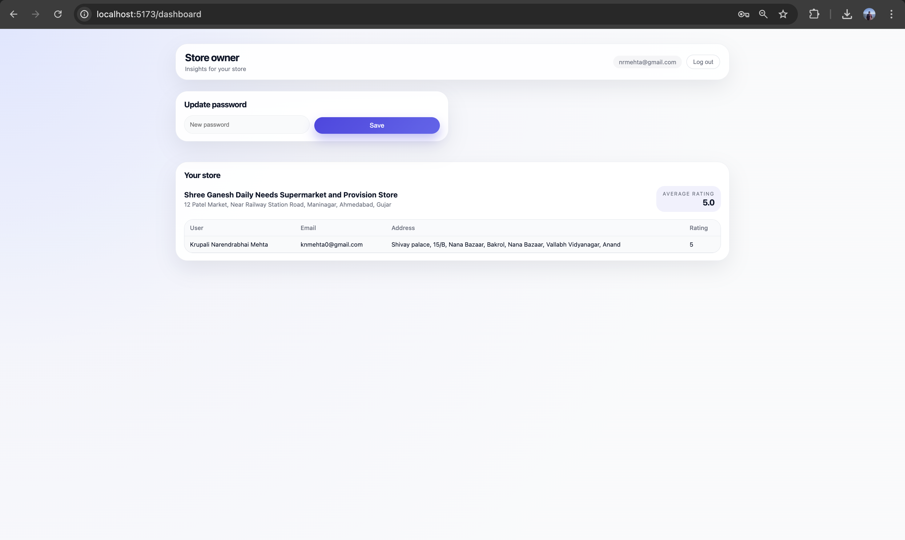

# ⭐ Store Rating Platform

A modern full-stack web application for managing stores and collecting user ratings with role-based dashboards for Admins, Users, and Store Owners.

<p align="center">
  
</p>

---

## Overview

A clean, minimal, premium UI full‑stack platform where users browse stores, give ratings, and manage profiles.  
Admins manage users & stores, while store owners view analytics and ratings for assigned stores.

---

## 🚀 Tech Stack

**Frontend:** React, Vite, React Router, Modern CSS  
**Backend:** Node.js, Express, PostgreSQL (Supabase), JWT Auth, Bcrypt  
**Tools:** Supabase Dashboard, VSCode, Postman  

---

## 📂 Project Structure

```text
store-rating-app/
├── backend/
├── frontend/
├── Images/
│   ├── Admin panel.png
│   ├── Create Account.png
│   ├── language .png
│   ├── Owner.png
│   ├── Schema visualizer.png
│   ├── Sign in.png
│   ├── Store Rating Platform Diagrams.png
│   ├── Tables .png
│   └── User.png
└── README.md
```

---

## 📸 Screenshots

### 🔐 Sign In  


### 🆕 Create Account  


### 👑 Admin Dashboard  


### 🙋‍♂️ User Dashboard  


### 🏪 Store Owner Dashboard  


---

## 🧩 Architecture & Database

### System Architecture  


### Supabase Schema Visualizer  


### Tables View  


---

## 🧠 Role-Based Features

### 👑 Admin
- Create users (Admin, Owner, User)  
- Create stores + assign owners  
- View stats for users, stores, ratings  
- Search / filter / sort  
- Validation popups  

### 🙋‍♂️ User
- Browse stores  
- Rate stores (1–5 stars)  
- Update rating  
- Update password  

### 🏪 Store Owner
- View assigned store  
- View average rating  
- View rating details  
- Update password  

---

## ✔ Validation Rules

### User
- **Name:** 20–60 characters  
- **Address:** ≤ 400 characters  
- **Password:** 8–16 chars, 1 uppercase, 1 special character  
- **Email:** valid  

### Store
- **Name:** 20–60 characters  
- **Email:** valid  
- **Owner ID:** must exist  

Invalid →  
🟥 `Please enter valid data.`

---

## 🛠 Setup

### Backend
```bash
cd backend
cp .env.example .env
npm install
npm run migrate
npm run dev
```

### Frontend
```bash
cd frontend
cp .env.example .env
npm install
npm run dev
```

---

## 🔐 Default Admin Login

```
Email: jm.jaymehta2222@gmail.com
Password: Jay@1101
```

---

## 🏁 Conclusion

This project demonstrates:

- Clean UI/UX  
- Secure role-based access  
- Real-world validation  
- Full-stack architecture  
- Supabase integration  

⭐ If you like this project, star the repo!
